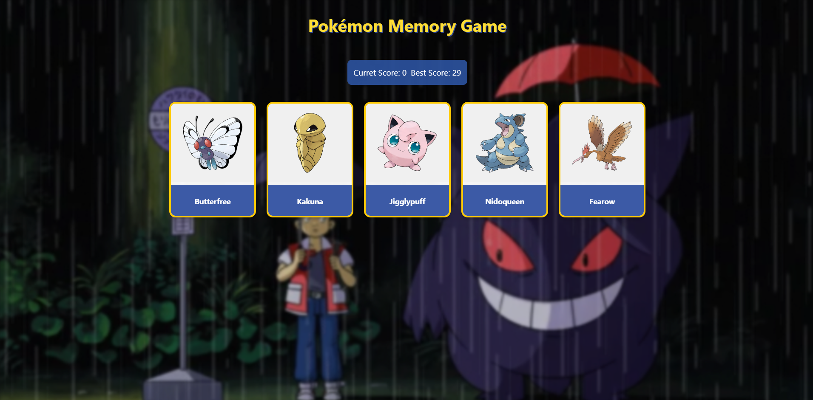
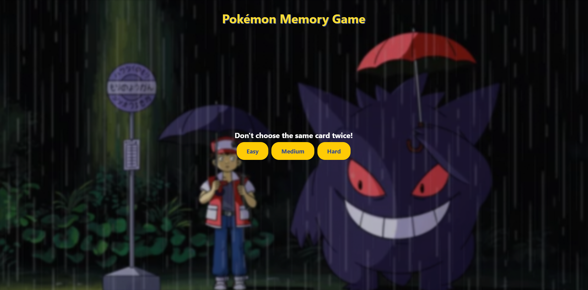

 Pokémon Memory Card Game 🎮⚡

 


Test your memory skills with Pokémon characters! Match cards without repeating your choices, and climb the leaderboards with different difficulty levels.




## Features ✨

- **3 Difficulty Levels**
  - 🟢 Easy: 
  - 🟠 Medium: 
  - 🔴 Hard: 
- 🏆 Score tracking with best score persistence
- 🎮 Responsive design for all screen sizes
- 🎵 Sound effects for card clicks and game over
- 🎮 Interactive game over modal with restart option
- 🔄 Dynamic card shuffling mechanics
- 📱 Mobile-friendly interface

## How to Play 🕹️

1. Choose your difficulty level
2. Click cards to reveal Pokémon characters
3. Don't click the same card twice!
4. Earn higher scores by remembering previous choices
5. Reach the maximum possible score for your difficulty level to win!

**Scoring System:**
1 point per correct guess (Max 6)

## Installation 💻

1. Clone the repository:
```bash
git clone https://github.com/your-username/pokemon-memory-game.git
Install dependencies:

bash
Copy
npm install
Start the development server:

bash
Copy
npm run dev
Technologies Used 🛠️
React

Vite

Axios for API calls

Howler.js for sound management

PokéAPI for Pokémon data

CSS3 for animations and styling

Contributing 🤝
Contributions are welcome! Please follow these steps:

Fork the project

Create your feature branch (git checkout -b feature/AmazingFeature)

Commit your changes (git commit -m 'Add some AmazingFeature')

Push to the branch (git push origin feature/AmazingFeature)

Open a Pull Request

License 📄
Distributed under the MIT License. See LICENSE for more information.

Acknowledgments 🎉
Pokémon characters and images © Nintendo/Creatures Inc./GAME FREAK Inc.

Sound effects from freesound.org

Inspired by classic memory card games

